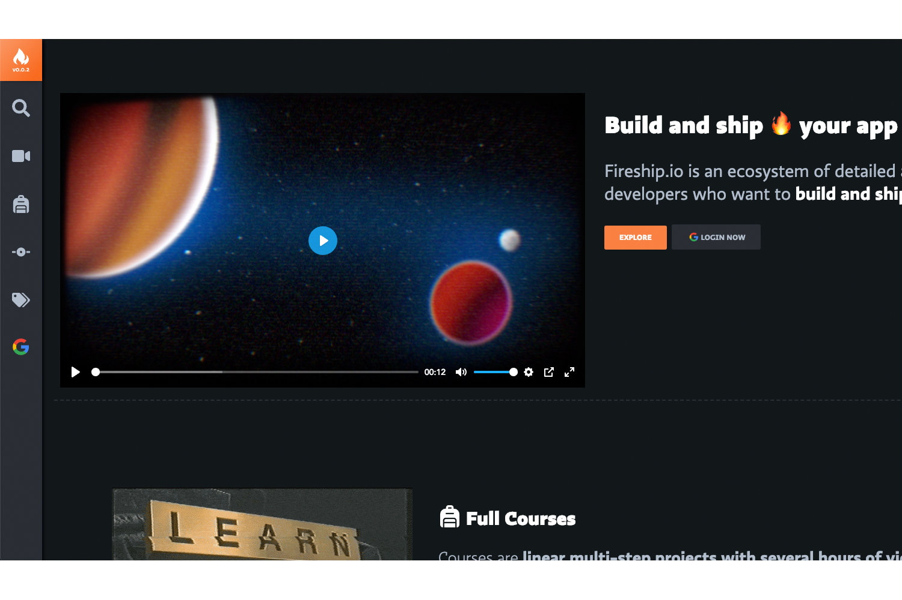

# Theme for https://fireship.io/

There are a few required content items, you can find them all in the `exampleSite` folder.

I would suggest running this theme as a submodule
```
git submodule add https://github.com/ajonp/ajonp-fireship-theme.git hugo/themes/ajonp-fireship-theme
```

If you need to update you can run 
```
git submodule init
git submodule update --remote
```

